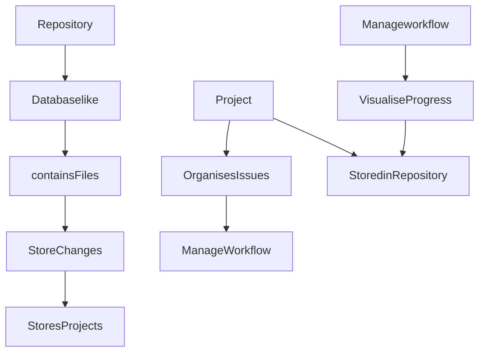

# CMPG-323-Overview-32084463

# Which repositories will be created and used for each project
The CMPG-323-Overview as its going to be linked to the project and the main branching is on this repository

# Diagram explaining project and repository context and how they are integrated

# The branching strategy to be used within each project
Smaller teams or online applications/products that do not need to support many versions can work more quickly thanks to the branching technique. The primary branch of GitHub flow houses your production-ready code.

# The use of a .gitignore file within each project
Gitignore files are used to make sure that specific files that git does not track continue to be untracked. Let's say you execute git add. in the repository's root directory and nothing is being ignored. You've just updated the index to include all of the files you previously ignored in your head.

# The storage of credentials and sensitive information
You can use the git-credential-store to store password, unencrypted data and sensetive information in github.But its not advisable that you store sensetive information on github,as the repository can be made public. The main function of GitHub is to host code repositories. There is no other way of security that can guarantee that your secret keys, personal credentials, and sensitive data remain in a regulated and secured environment except from the permissions you specify on your account.
How do you safely preserve secrets?
To store secrets, use encryption.

To encrypt and decrypt secrets, you now need to manage extra security keys, which raises a new problem to take into account. It may seem like an endless challenge because these keys also need to be kept safe and securely distributed.
